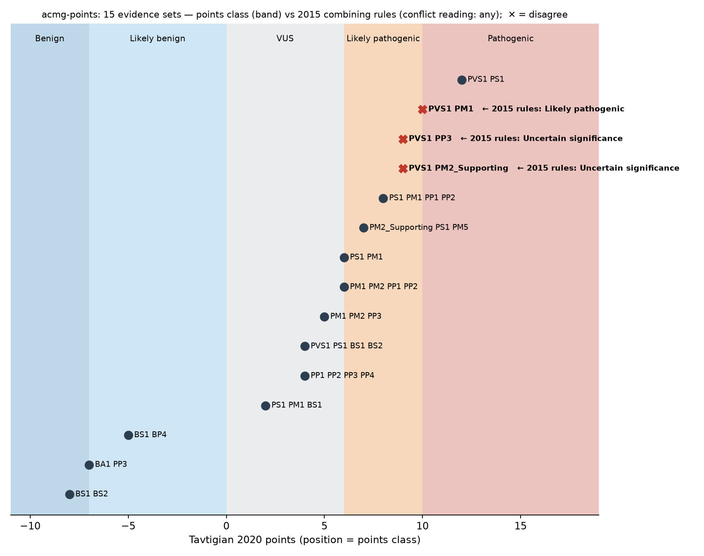
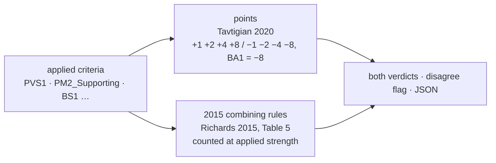

# acmg-points 

[](https://github.com/MargoSolo/acmg-points/actions/workflows/ci.yml)
[](https://doi.org/10.5281/zenodo.22286276)
 


**Points-based ACMG/AMP variant classification, side by side with the 2015 combining rules — so you can see exactly where the two systems disagree on your evidence.**

ClinGen is moving variant classification from the 2015 combining rules to a points system (Tavtigian 2020, the basis of the forthcoming SVC v4). Most labs still reason in 2015 rules; most calculators implement one system or the other. `acmg-points` runs **both on the same evidence** and flags the disagreements, with the provenance of every point.

```bash
pip install git+https://github.com/MargoSolo/acmg-points      # no dependencies
acmg-points classify PVS1 PM1
```
```
  PVS1  VeryStrong  +8
  PM1   Moderate    +2
  total             +10 → Pathogenic          [tavtigian2020]
  2015 rules        → Likely pathogenic       (2015 combining rule met)
  ⚠️ SCHEMES DISAGREE
```

## Where the systems disagree

Fifteen evidence sets from `examples/cases.txt`, placed on the points scale; the band gives the points class, and ✕ marks the sets where the 2015 rules say something else:



| evidence | points | points class | 2015 class | why |
|---|---|---|---|---|
| PVS1 + PM1 (one Moderate) | +10 | **Pathogenic** | Likely pathogenic | 2015 needs PVS1 + ≥ 2 Moderate for Pathogenic; points reach 10 with one |
| PVS1 + PP3 (one Supporting) | +9 | **Likely pathogenic** | VUS | 2015 needs ≥ 2 Supporting next to PVS1; points need one |
| PVS1 + PM2_Supporting | +9 | **Likely pathogenic** | VUS | the same pattern with PM2 at the strength ClinGen SVI recommends since 2020 |

Full table: [`examples/compare.md`](examples/compare.md).

**Conflicting evidence.** Richards 2015 puts a variant in *Uncertain significance* when "the criteria for benign and pathogenic are contradictory". That sentence has two readings, and implementations differ. `acmg-points` defaults to the stricter one and lets you switch:

| `--conflict` | reading | PS1 + PM1 + BS1 |
|---|---|---|
| `any` (default) | any pathogenic evidence together with any benign evidence → VUS | VUS (points: +2, VUS too) |
| `both-met` | VUS only when a pathogenic rule *and* a benign rule are both met | Likely pathogenic |

BA1 is stand-alone benign evidence under both readings and is not overridden by supporting pathogenic criteria. The JSON output records which reading was used.

**PM2.** The 2015 default is Moderate; ClinGen SVI recommended PM2 at Supporting strength in 2020. Apply it as `PM2_Supporting` — the package does not silently downgrade it, because the strength is your decision.

## Use

```bash
acmg-points classify PVS1 PM2_Supporting PP3      # modified strengths: CODE_Strength (also CODE:Strength, CODE-Sup)
acmg-points classify PS1 PM1 --json               # per-criterion points and both verdicts, machine-readable
acmg-points compare --file cases.txt              # one evidence set per line, '#' comments → markdown table
acmg-points table                                 # the scheme in force, with citation
```
Strengths: `Supporting` `Moderate` `Strong` `VeryStrong` (`Sup`/`Mod`/`Str`/`VS`), `StandAlone` for BA1. Applying a criterion twice is an error.

## What is implemented — and what deliberately is not



- **Points:** Tavtigian et al. 2020, *Hum Mutat* 41:1734. Bands: Pathogenic ≥ 10 · Likely pathogenic 6–9 · VUS 0–5 · Likely benign −6…−1 · Benign ≤ −7.
- **2015 rules:** Richards et al. 2015, *Genet Med* 17:405, including the conflict rule. Criteria count at their **applied** strength (`PM2_Supporting` is a Supporting criterion), as ClinGen SVI modifiers intend.
- **Not implemented on purpose:** any "SVC v4.0 points table". v4 is in pilot and unpublished. Schemes live in one file, `schemes.py`; when the official table appears it becomes a second scheme, not a rewrite.

This is a **combiner**, not a classifier: it assumes you have decided which criteria apply at which strength. It does not assess evidence, query gnomAD, or know VCEP gene-specific specifications. It will also happily sum criteria that should not be co-applied (e.g. PVS1 with PM4) — mutual-exclusion checks are on the roadmap.

## Tests

Five `pytest` cases pin the published bands, the strength modifiers, the 2015 conflict rule and the three divergences above; CI also regenerates the comparison table.

## Roadmap

Official SVC v4.0 table as a drop-in scheme · SVI modifier library (PVS1 decision tree, calibrated PP3/BP4) · co-application checks · VCEP-specific schemes · batch from CSV / VCF INFO · JOSS paper.

## Cite

DOI (all versions): 10.5281/zenodo.22286276 · this version: 10.5281/zenodo.22286277

Soloshenko M. *acmg-points: points-based ACMG/AMP classification alongside the 2015 rules.* 2026, v0.1.0. Please also cite Tavtigian et al. 2020 and Richards et al. 2015 — the science is theirs. MIT License.
